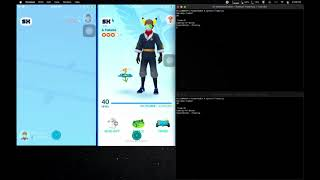

# ZXTouch Scripts For Various Things in Pokemon Go

### Requirements 
SX-Bypass: https://repo.sx-pokego.xyz/ 

ZXTouch: http://zxtouch.net 

[ZXTouch Library](https://github.com/xuan32546/IOS13-SimulateTouch/tree/0.0.6/layout/usr/lib/python3.7/site-packages/zxtouch) - Goes in "site-packages" folder of python install 
  
----
Only tested on iPhone 7 & iPhone 8 (both same screen size)

Orignal scripts should have the correct values for 4.7" screens 

Other sizes will have to be manually found and adjusted using ColorFinder Script

## [Trading](Scripts/Trade.py)
Demo Video:

Requires 2 Jailbroken Devices

Make 2 copies of the script and configure each seperatly with the IP of the devices

Run both scripts and input the same amount of trades in each

The script will go in order of buttons
  1. Trade Button
  2. Pokemon Selection (1st Slot, unless manually configured otherwise)
  3. Next Button
  4. Confirm Button
  5. Exit Button

It will use a color picker to match (x, y) coordinates to the set value and press the buttons when it finds a match. 

WILL GET STUCK ON FAVORITED POKEMON, OTHERWISE TRADES EVERYTHING

(It helps to manually do a special trade before running)

## Evolve Pokemon

## Purify Pokemon

## Using [Color Finder](Scripts/ColorFinder.py)
  1. On Device use ZXTouch Indicator to find coordinates of the button
  2. Run ColorFinder.py 
  3. Input the Device's IP
  4. Input X coordinate, then Y coordinate 
  5. Replace the value of coordinates and color in script
  6. Do for all buttons
