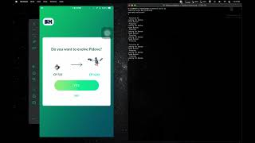
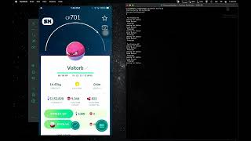

# ZXTouch Scripts For Various Things in Pokemon Go

### Requirements 
SX-Bypass: https://repo.sx-pokego.xyz/ 

ZXTouch: http://zxtouch.net 

Python installed on Computer

[ZXTouch Library](https://github.com/xuan32546/IOS13-SimulateTouch/tree/0.0.6/layout/usr/lib/python3.7/site-packages/zxtouch) - Goes in "site-packages" folder of python install 
 
---- 
I AM NOT THE CREATOR OF SX-BYPASS OR ZXTOUCH

THESE SCRIPTS JUST USE THEM

----
Only tested on iPhone 7 & iPhone 8 (both same screen size 4.7")

Other sizes will have to be manually found and adjusted using ColorFinder Script

## [Trading](Scripts/Trade.py)
Demo Video:

Requires 2 Jailbroken Devices

Make 2 copies of the script and configure each seperatly with the IP of the devices

Run both scripts from profile pages and input the same amount of trades in each

The script will go in order of buttons
  1. [Trade Button](Demos/Trade/Profile.PNG)
  2. [Pokemon Selection](Demos/Trade/PokeSelect.PNG) (1st Slot, unless manually configured otherwise)
  3. [Next Button](Demos/Trade/Next.PNG)
  4. [Confirm Button](Demos/Trade/Confirm.PNG)
  5. [Exit Button](Demos/Trade/Exit.PNG)

It will use a color picker to match (x, y) coordinates to the set value and press the buttons when it finds a match. 

WILL GET STUCK ON FAVORITED POKEMON, OTHERWISE TRADES EVERYTHING

(It helps to manually do a special trade before running)
## [Evolve](Scripts/Evolve.py)
Demo Video:

Gets stuck on shadow pokemon as the evolve button is moved/offscreen at times.

Pokemon that use items will also get stuck

Filter by "Can Evolve" and start script

The script will go in order of buttons
  1. [Pokemon Selection](Demos/Evo/PokeSelect.PNG) (1st Slot, unless manually configured otherwise)
  2. [Evolve Button](Demos/Evo/Evo.PNG)
  3. [Confirm Button](Demos/Evo/Next.PNG)
  4. [Exit Button](Demos/Evo/Exit.PNG)

## [Purify](Scripts/Purify.py)
Demo Video:

Filter by Shadow Pokemon and Start
The script will go in order of buttons
  1. [Pokemon Selection](Demos/Pure/PokeSelect.PNG) (1st Slot, unless manually configured otherwise)
  2. [Purify Button](Demos/Pure/Pure.PNG)
  3. [Confirm Button](Demos/Pure/Next.PNG)
  4. [Exit Button](Demos/Pure/Exit.PNG)

## Using [Color Finder](Scripts/ColorFinder.py)
  1. On Device use ZXTouch Indicator to find coordinates of the button
  2. Run ColorFinder.py 
  3. Input the Device's IP
  4. Input X coordinate, then Y coordinate 
  5. Replace the value of coordinates and color in script
  6. Do for all buttons
